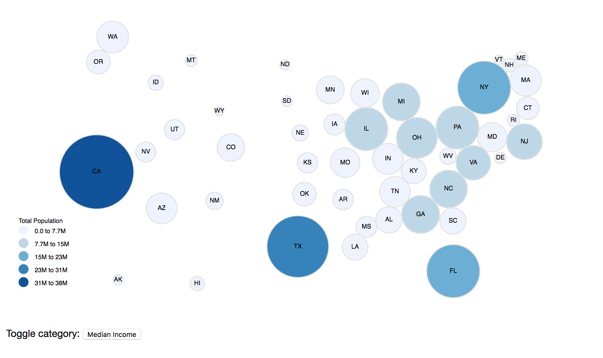
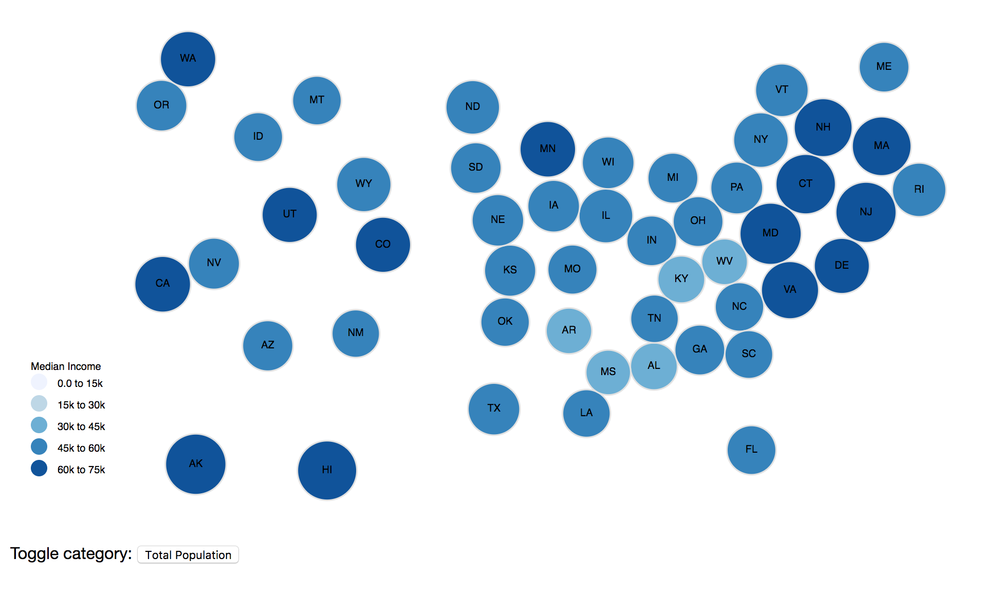

# Final Exam
Students will make a [**Dorling Cartogram**](http://carto.maps.arcgis.com/apps/StorytellingTextLegend/index.html?appid=b686a7679cb747e9825d1d1bb6b26046) using U.S. Census Data and GeoJSON representing the [centroids](https://en.wikipedia.org/wiki/Centroid) of U.S. States.

The cartogram will allow for toggling between two facets for each state: "total population" and "median income":

#### Total Population


#### Median Income


## Instructions
To complete this assignment and receive full credit you must:
- [ ] Use d3-force's simulation!
- [ ] use a "charge" force
- [ ] use a "collide" force
- [ ] load the GeoJSON and CSV data **async** using `d3.queue()`
- [ ] use `d3.geoAlbersUsa()` map projection to initially position circles
- [ ] use `d3.scaleSqrt()` to size the circles
- [ ] use `d3.scaleQuantize()` to color encode the circle fill
- [ ] first render the cartogram showing "total population"
- [ ] show a tooltip when mousing over the circles that displays the full state name and current data facet value
- [ ] render the legend using `d3-legend`
- [ ] have the cartogram toggle showing the "total population" and "median income" facets via an HTML button
- [ ] complete this assignment on your own
- [ ] commit your changes incrementally and descriptively to this repo and push them to its remote url
- [ ] comment each code block in your own words

## Hints
Look back to **class 10** when we used d3-force's `simulation` to create a bubble chart. We are doing a similar thing here but with a couple notable exceptions:

1. We will pre-define the array of nodes _prior to_ passing it to `d3.simulation()`. Using `var projection = d3.geoAlbersUsa()`, we can set the initial position of each node's `x`, `y`, `x0`, and `y0` position via `projection(d.geometry.coordinates)`. You should also store the lat, lon coordinates for each node as well. This can be all done via `geojson.features.map()`.

  ```js
  // within the callback to d3.queue().await()
  var nodes = geojson.features.map(function(d) {
    var point = projection(d.geometry.coordinates),
        value = population.get(d.id);

    return {
      id: d.id,
      name: d.properties.name,
      label: d.properties.label,
      coords: d.geometry.coordinates,
      x: point[0],
      y: point[1],
      x0: point[0],
      y0: point[1],
      r: radius(value),
      value: value
    };
  });
  ```

2. We only need to use two forces to create the Dorling Cartogram, `d3.forceManyBody` and `d3.forceCollide`. Be sure to use a strength equal to `1` for each force.

3. Because we need to reference our `simulation` in an update function later, make sure it can be referenced outside of the callback to `d3.queue().await()`. (_think global variable_)

### Main SVG Elements
You will need to have a circle and a label for each of the 50 states. You may either try grouping them in `svg` `g` elements, or you may simply create separate `circles` and `text` elements in the main `svg` element. IMO the latter is easier then dealing with nested selections.

### Tooltip
You should borrow the code from **class 10** for the **tooltip**. You'll need to have the event listeners that show, hide, and position the tooltip on the circles; _not the text elements._

### Data Management
Use two instances of `d3.map()` to store the values for `total population` and `median income` by state. Look to **class 11** for how we did this with the drug overdose data, in the formatting function to `d3.queue().defer(d3.csv, 'filename.csv', function(d) { /* look in here */ })`.

### Legend
For the **legend**, also look back to **class 11** for when we used the `d3-legend` plugin. We can use it again here, passing it our color scale.

Because we need to use the `legend` generator in the update function later, make sure it can be referenced outside of the callback to `d3.queue().await()`. (_think global variable_)

### Update
For the `update()` (that should happen when a user clicks a button), keep in mind the following:

1. Our `simulation`'s `nodes` data will already exist in the DOM after the first render. How would we select it instead of loading the data async again? (hint: `selection.data()` and `selection.datum()` can be called _without arguments_).

2. After getting the `nodes` array, you'll want to reset your scale domains, and reset the initial `x`, `y`, `x0`, and `y0` node positions using the lat lon coordinates. We also want to set the `value` property of each node to the new data variable (e.g. `median income` if it was previously `total population` and vice versa).

3. Remember, _we won't be removing any elements_, we only need to update them, so **DO NOT USE `.exit().remove()` or `.enter().append()`**.

4. To restart the `simulation` you will need to pass it the updated `nodes` array, set its `alpha` to `1`, then call `restart()`. Do this after updating the cartogram's circles and text elements.

5. Don't forget to update the legend, this is easier than it sounds. (_remember `selection.call()`_)

6. Use a boolean to track whether you're showing the `total population` or `median income`. Then flip it towards the end of the `update()`, but before you change the label for your button.

7. If you forget how to add a event handler / callback to a button, look back to **class 8** when we added one to the bar chart.

Remember to refer to the two images above for how the cartogram should look for each data facet. Try to break down each part into a separate problem, take breaks if you get stuck, and remember the d3 documentation and code from previous classes are there to refer to.

GOOD LUCK!!!
